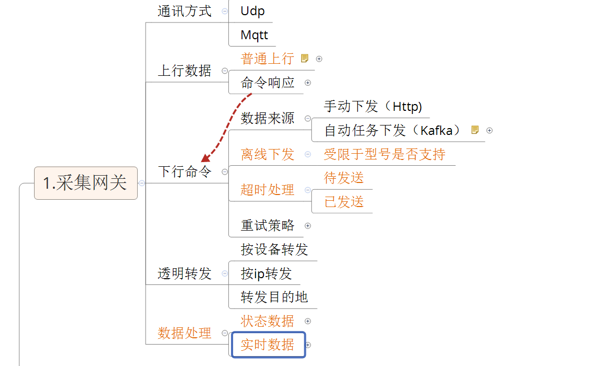
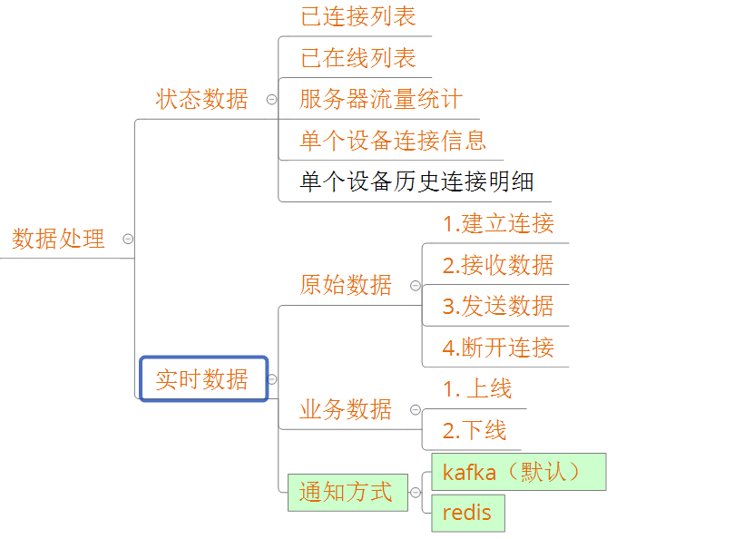

# iot-gateway
iot通讯网关，支持tcp、udp等多种通讯方式接入，管理通讯连接，分发上行数据和下行指令。

## 一. 通讯方式
默认支持TCP、UDP

两者差异在于TCP需要提供额外的nettyHandler对象来处理分包

处理分包本身就隐含了需要处理 **协议** ，也就无法将网关处理和数据解析做彻底的分离。

## 二. 上行数据处理
上行数据，需要考虑上行数据的分发目的地，有可能是kafka，redis或其他

### 2.1 在线列表
存储设备所在机器及刷新时间，用于后续下行发送时候，定位设备。

1. 检测到上线、下线事件后，主动存储到redis，设置永不过期，缺点:服务端宕机后，仍旧会显示设备在线
2. 检测到上线、下线事件后，主动存储到redis，设置20s过期，缺点。需要实时(接收到数据后)/定时更新redis。

建议采用第一种，
1. 服务端宕机仍显示在线，可以在页面上标注服务器状态，在线的设备则相当于保留了最后一次快照，可能有利于后续定位问题
2. 可以设置一个比较长的过时时间。

### 2.2 服务端信息统计
### 2.3. 普通上行数据分发
该数据独立自解析，即可以针对该报文直接解析出是哪个对象的数据，存储分发即可

### 2.4 命令响应数据分发
该数据是由于之前命令下发之后，设备上报的响应数据，
需要找到之前下发的历史记录，并判断是否超时，之后将处理好的数据传递给下发方。

需要注意的是:可能一次请求，多次响应

### 2.5 需要响应的数据
部分数据可能需要返回相应的报文给设备，这里也会出现几种情况
1. 所有响应都是公用结构，只有些许差异
如每次接收数据后，提供一个ACK，差异就是流水号要和请求一致

2. 所有响应都是特殊结构
如发送的A0，返回F0,并且不同的请求，返回的body都不一样，

## 三. 下行指令
### 1. 数据来源
下发用户有可能是来源于网页，还可能来自定时任务
所以需要提供不同的方式以供两者正常使用

网页端直接调用http
定时任务则采用kafka

### 2. 离线下发
受限于型号，某些设备不支持离线下发

离线存储需要配置最大存储时长

### 3. 超时处理
待下发的和已下发的

### 4.重试策略
重试的条件，时机、最大重试次数

## 四. 透明转发
一般用于升级，单个连接转发，如果大批量转发，可以将原始数据通过kafka分发，然后启用一个Consumer，消费转发

按设备
按ip
转发目的地

## 五. 数据处理

监控页面：
http://gateway.fengziru.com/